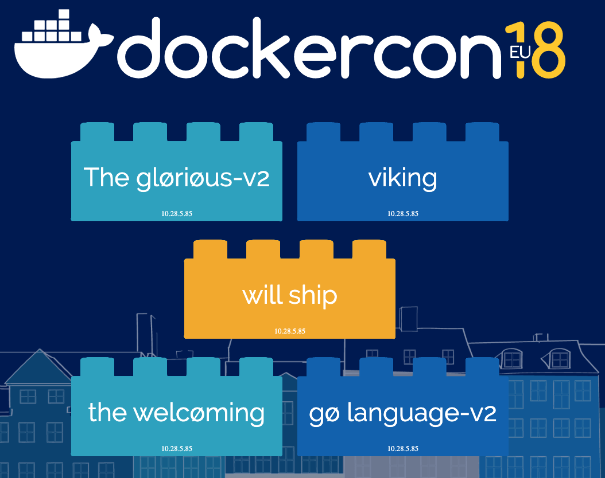
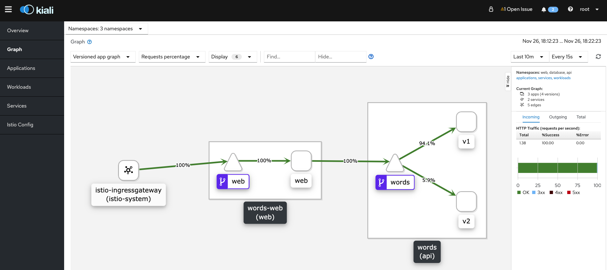

# Istio + GKE + Apigee

Wordsmith is the demo project shown at DockerCon EU 2017, where Docker announced that support for Kubernetes was coming to the Docker platform.

The demo app runs across three containers:

- [db](db/Dockerfile) - a Postgres database which stores words

- [words](words/Dockerfile) - a Java REST API which serves words read from the database

- [words-v2](words-v2/Dockerfile) - a Java REST API which serves words + v2 read from the database, this version was instruduced for this example (istio) and doesn't exisist in the original repo

- [web](web/Dockerfile) - a Go web application which calls the API and builds words into sentences:

## For further references of this project please visit: [K8s Word Smith](https://github.com/dockersamples/k8s-wordsmith-demo)

# Must Have for this example

The Requirements for this example are:

```
GKE Cluster with Istio Enabled (At least 3 nodes n1-standard-2, mTLS Strict)

KubeControl (kubectl) on your Machine

Istio (istioctl) on your Machine

Docker on your machine
```

> You can use pre-built images from Docker Hub Described on [Deploy File](k8s-deploy/words-smith-deploy.yaml) or you can tag and push the images on your project private gcr.io (this apply for these Docker files: - [db](db/Dockerfile),[words](words/Dockerfile),[words-v2](words-v2/Dockerfile),[web](web/Dockerfile))
```
docker build -t gcr.io/your-gcp-project/words-v2:latest .
docker push gcr.io/your-gcp-project/words-v2:latest
```

## Deploy `Words` as K8S Stack
From root folder of project:
- Create NameSpaces for the Stack
```
$ chmod +d k8s-deployment/namespaces.sh
$ ./k8s-deployment/namespaces.sh
```
- Then verify namespaces:
```
$ kubectl get namespaces
NAME              STATUS   AGE
api               Active   150m
database          Active   150m
default           Active   152m
istio-system      Active   152m
web               Active   150m
```
- Now you can execute deployment with kubectl [Deploy](k8s-deploy/words-smith-deploy.yaml)
```
kubectl apply -f k8s-deploy/words-smith-deploy.yaml
```
Wait until finish, and verify with the following command, you'll also see all istio services:

```
$ kubectl get svc -A
NAME   TYPE        CLUSTER-IP    EXTERNAL-IP   PORT(S)    AGE
db     ClusterIP   10.28.15.16   <none>        5432/TCP   137m
web    ClusterIP   10.28.0.76    <none>        8081/TCP   137m
words  ClusterIP   10.28.5.85    <none>        8080/TCP   137m
```

- Next you need to create an `Istio GateWay`  and `VirtualServices` to map the web app with the correct gateway with the following file [GateWayAndVirtualSVC](istio/gateway-words.yaml):
```
$ kubectl apply -f istio/gateway-words.yaml
```
- Validate the gateway and virtual service:
```
$ kubectl get Gateway -A
NAMESPACE      NAME             AGE
istio-system   ingressgateway   129m
web            web-gateway      161m
```
```
$ kubectl get VirtualService -A
NAMESPACE   NAME                   GATEWAYS        HOSTS     AGE
web         web-virtualservice     [web-gateway]   [*]       162m
```

- Now we need a virtual service and a destination rule to direct web trafic to words api to be able to get words 
- Execute the deployment with [VirtualServiceAndDestinationRoute](istio/route-words.yaml)
```
$ kubectl apply -f istio/route-words.yaml
```
- Verify virtual service and destination routes
```
$ kubectl get VirtualService -A
NAMESPACE   NAME                   GATEWAYS        HOSTS     AGE
api         words-virtualservice                   [words]   106m
web         web-virtualservice     [web-gateway]   [*]       162m
```
```
$ kubectl get DestinationRule -A
NAMESPACE      NAME                HOST                                             AGE
api            words-destination   words                                            166m
```
- Now you can verify the web app working on the `Istio ingress IP`
- How to locate [Istio Gateway](https://istio.io/docs/concepts/traffic-management/#gateways)
- You'll see something like this:

## Deploy `Words` as Canary Deployment for words API
- Delete words virtual service
```
kubectl delete VirtualService words-virtualservice
```
- Execute the canary deployment with [Canary](istio/canary-words.yaml)
```
$ kubectl apply -f istio/canary-words.yaml
```
- To verify this execute 
```
$ kubectl get VirtualService -A
NAMESPACE   NAME                   GATEWAYS        HOSTS     AGE
api         words-virtualservice                   [words]   106m
web         web-virtualservice     [web-gateway]   [*]       162m
```
- In order to visualise this behaviour we need to instal [Kaili](https://istio.io/docs/tasks/observability/kiali/)
- After done Kaili installation, Login into Kaili -> Graph
- Select three namespaces: web, api, database
- Versioned app graph
- Requests percentage
- And you'll se something like:

